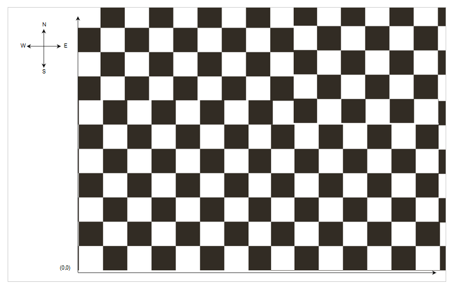

# Mars Rover Kata

## Rules

* Initial position in (0, 0) directed to the North
* Commands F, B (forward backward)
* R, L (Right, Left) is not a move but a change of direction
* The initial command array is: ['F', 'F', 'R', 'F', 'F']
* The point of arrival is (2, 2)
* One person codes the test, another the implementation then we change
    

https://fr.slideshare.net/pkofler/coding-dojo-mars-rover
